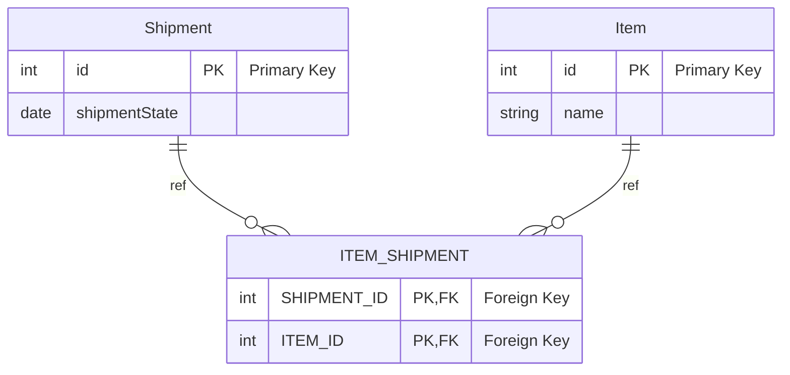

# 고급 엔티티 연관관계 매핑


## 일대일 

두 엔티티가 서로 단일 인스턴스와 연결되는 관계
`User`와 `UserProfile` 간의 관계. 한 사용자는 하나의 프로필을 가지며, 하나의 프로필은 하나의 사용자에만 속함

### 엔티티 설계

#### User 엔티티

```java
@Entity
public class User {
    @Id
    @GeneratedValue(strategy = GenerationType.IDENTITY)
    private Long id;

    @OneToOne(mappedBy = "user", cascade = CascadeType.ALL, orphanRemoval = true)
    private UserProfile profile;

    // 기타 필드 및 메소드
}
```

#### UserProfile 엔티티

```java
@Entity
public class UserProfile {
    @Id
    @GeneratedValue(strategy = GenerationType.IDENTITY)
    private Long id;

    @OneToOne
    @JoinColumn(name = "user_id")
    private User user;

    // 기타 필드 및 메소드
}
```

#### 매핑 설명

- **`@OneToOne`**: 일대일 관계를 정의
- **`mappedBy`**: 관계의 소유자가 아닌 쪽에서 관계를 정의
- **`@JoinColumn`**: 관계의 소유자 쪽에서 외래 키를 지정
- **`cascade`**: 엔티티 연관관계에 따라 연관된 엔티티를 자동으로 저장, 삭제
- **`orphanRemoval`**: 부모 엔티티와의 관계가 끊어진 자식 엔티티를 자동으로 삭제

#### DB 스키마

- **User** 테이블
  - `id` (Primary Key)
- **UserProfile** 테이블
  - `id` (Primary Key)
  - `user_id` (Foreign Key)

```sql
CREATE TABLE User (
    id BIGINT AUTO_INCREMENT PRIMARY KEY
);

CREATE TABLE UserProfile (
    id BIGINT AUTO_INCREMENT PRIMARY KEY,
    user_id BIGINT,
    FOREIGN KEY (user_id) REFERENCES User(id)
);
```

### 연관관계 설정 및 사용

#### 엔티티 생성 및 저장

```java
User user = new User();
UserProfile profile = new UserProfile();

user.setProfile(profile);
profile.setUser(user);

entityManager.persist(user); // User와 UserProfile이 동시에 저장됨
```

#### 연관관계 조회

```java
User user = entityManager.find(User.class, 1L);
UserProfile profile = user.getProfile();

UserProfile profile = entityManager.find(UserProfile.class, 1L);
User user = profile.getUser();
```

### 특징

- **데이터 무결성 유지**: 강력한 일관성 보장
- **단순한 쿼리**: 효율적인 데이터 조회

### 주의해야할 것.

#### 대상 테이블에 외래 키
JPA에서는 일대일 방향 관계에서 대상 테이블에 외래 키가 있는 경우를 지원하지 않는다.
 => 연관관계를 수정하거나, 양방향으로 만들고 대상 테이블 엔티티를 연관관계의 주인으로 설정해야함. 
     ex) 주 테이블 ``@OneToOne(mappedBy="")``, 대상 테이블 ``@OneToOne @JoinColumn``


### 공유 기본키 엔티티 연관관계

```java
@Entity
public class Address {

    @Id
    @GeneratedValue(generator = Constants.ID_GENERATOR)
    private Long id;

    @NotNull
    private String street;

    @NotNull
    private String zipcode;

    @NotNull
    private String city;

    public Address() {
    }
}

@Entity
@Table(name = "USERS")
public class User {

    @Id // 
    private Long id;

    private String username;

    @OneToOne(
            fetch = FetchType.LAZY,
            optional = false,
            cascade = CascadeType.ALL
    )
    @PrimaryKeyJoinColumn
    private Address shippingAddress;

    public User() {
    }
}
```
#### 매핑 설명

**``optional=false``**
FK에 not null 제약조건이 걸린 DDL 발생
``true``로 사용 시, FK가 nullable하므로 FK 값이 없는 데이터가 존재할 수 있음.

**조회 SQL**
```sql
// true인 경우
// outer join 실행
SELECT *
// car의 user_id = null인 레코드는 제외된다. => 스키마가 nullable하기 때문.
FROM Car JOIN User ON Car.user_id = User.id 
WHERE Car.id = ?;

// false인 경우
// inner join 실행
select b1_0.id, a1_0.id 
from b b1_0 left join a a1_0 on a1_0.id=b1_0.fk 
where b1_0.id=?
```


**``@PrimaryKeyJoinColumn``**
공유 기본키 전략
User(부모) -> Address(자식) 단방향 공유 기본키 일대일 연관관계 매핑을 할 때 사용한다.

```java
Address address = new Address("Flowers Street", "01246", "Boston");
addressRepository.save(address);

User john = new User(address.getId(), // Assign same identifier value
        "John Smith"
);
john.setShippingAddress(address);
userRepository.save(john);

User user = userRepository.findById(john.getId()).get();
```

-> 두 엔티티 중 하나가 항상 다른 엔티티보다 먼저 저장되고 기본키 소스 역할을 할 수 있는 경우 공유 기본키 연관관계를 사용할 수 있다.
-> 그 외 경우는 외래키 연관관계를 사용한다.

### 외래키 조인 컬럼 활용
- 일반적인 사용되는 1:1 매핑.
- 외래키를 포함하는 경우, 테이블의 로우가 로드될 때 FK 값도 포함하고 있다.
- 따라서, 하이버네이트는 참조 테이블의 데이터가 있는지 알고 있고, Proxy를 통하여 필요에 따라 인스턴스를 지연 로딩할 수 있다.
- FK 값이 고유해야 할 경우 ``unique=true`` 설정으로 고유한 값을 가질 수 있다.

> JPA에서는 지연로딩을 할 경우 객체 그래프 상의 엔티티들은 즉시 조회되지 않고, Proxy 객체가 대체되어 있다.
> Proxy 객체가 호출될 때, 실제 엔티티를 조회한다.

#### Example

```java
@Entity
public class Address {

    @Id
    @GeneratedValue(generator = Constants.ID_GENERATOR)
    private Long id;

    @NotNull
    private String street;

    @NotNull
    private String zipcode;

    @NotNull
    private String city;

    public Address() {
    }
}

@Entity
@Table(name = "USERS")
public class User {

    @Id
    @GeneratedValue(generator = Constants.ID_GENERATOR)
    private Long id;

    private String username;

    // 단방향 매핑
    @OneToOne(
            fetch = FetchType.LAZY,
            optional = false, // NOT NULL
            cascade = CascadeType.PERSIST
    )
    @JoinColumn(unique = true)
    private Address shippingAddress;

    public User() {
    }
}

```

#### Test

```java
User john = new User("John Smith");

Address address = new Address("Flowers Street", "01246", "Boston");

john.setShippingAddress(address);

userRepository.save(john);
```


### 조인 테이블 활용
일대일 연관관계가 선택 사항인 경우, 링크 테이블을 사용한다.(null 허용 컬럼 문제)
참조 테이블의 로우가 있을 경우 포함하고, 없을 경우 로우를 포함하지 않는 링크 테이블을 사용하면 nullable 문제를 해결할 수 있다.

```java

@Entity
public class Shipment {

    @Id
    @GeneratedValue(generator = Constants.ID_GENERATOR)
    private Long id;

    @NotNull
    @CreationTimestamp
    private LocalDateTime createdOn;

    @NotNull
    private ShipmentState shipmentState = ShipmentState.TRANSIT;

    @OneToOne(fetch = FetchType.LAZY)
    @JoinTable(
            name = "ITEM_SHIPMENT", // 필수
            joinColumns = @JoinColumn(name = "SHIPMENT_ID"),    // 주 테이블의 식별 값
            inverseJoinColumns = @JoinColumn(name = "ITEM_ID",  // 대상 테이블의 식별 값
                    nullable = false, unique = true)
    )
    private Item auction;

    public Shipment() {
    }
}

@Entity
public class Item {

    @Id
    @GeneratedValue(generator = Constants.ID_GENERATOR)
    private Long id;

    private String name;

    public Item() {
    }
}
```

**`@JoinTable`**: 조인 테이블을 지정하여 관계를 매핑
  - `name`: 조인 테이블의 이름
  - `joinColumns`: 현재 엔티티를 참조하는 외래 키
  - `inverseJoinColumns`: 연관된 엔티티를 참조하는 외래 키
다대다 관계를 관리하기 위한 중간 테이블을 자동으로 생성하고 유지한다.




#### 조인 테이블 = 연결 테이블 = 링크 테이블

**링크 테이블 - 객체**
객체는 서로 컬렉션을 참조하는 방식으로 다대다 매핑이 가능하다.``@ManyToMany``
엔티티는 연결 테이블을 신경쓰지 않아도 된다.
연관관계 매핑 시 연결 테이블에 INSERT가 영속 전이
엔티티 컬렉션을 통한 조회 시, 연결 테이블과 조회 대상을 조인하는 쿼리 발생

**링크 테이블 - DB**
관계형 DB는 정규화된 테이블 2개로 다대다를 표현할 수 없으므로 연결 테이블을 사용한다.
 => 양 측 모두 FK를 넣을 수 있는 컬럼은 한개이기 때문.
양 측 테이블의 ID들이 담긴 연결 테이블을 사용한다.


#### Test

```java
// 단일 엔티티 저장
Shipment shipment = new Shipment();
shipmentRepository.save(shipment);


Item item = new Item("Foo");
itemRepository.save(item);

// Item 연결 엔티티 저장
Shipment auctionShipment = new Shipment(item);
shipmentRepository.save(auctionShipment);
```


## 다대일

- **다대일 연관관계**: 여러 엔티티가 단일 엔티티와 연결되는 관계

- `Order`와 `Customer` 간의 관계. 여러 주문이 하나의 고객에게 속함


### 엔티티 설계

#### Customer 엔티티

```java
@Entity
public class Customer {
    @Id
    @GeneratedValue(strategy = GenerationType.IDENTITY)
    private Long id;

    @OneToMany(mappedBy = "customer", cascade = CascadeType.ALL, orphanRemoval = true)
    private List<Order> orders = new ArrayList<>();

    // 기타 필드 및 메소드
}
```


#### Order 엔티티

```java
@Entity
public class Order {
    @Id
    @GeneratedValue(strategy = GenerationType.IDENTITY)
    private Long id;

    @ManyToOne
    @JoinColumn(name = "customer_id")
    private Customer customer;

    // 기타 필드 및 메소드
}
```

#### 매핑 설명

- **`@OneToMany`**: 다대일 관계에서 여러 인스턴스를 소유하는 쪽에서 설정
- **`mappedBy`**: 관계의 소유자가 아닌 쪽에서 관계를 정의
- **`@ManyToOne`**: 다대일 관계에서 단일 인스턴스를 소유하는 쪽에서 설정
- **`@JoinColumn`**: 외래 키를 지정하여 관계를 매핑

#### DB 스키마

- **Customer** 테이블
  - `id` (Primary Key)
- **Order** 테이블
  - `id` (Primary Key)
  - `customer_id` (Foreign Key)

```sql
CREATE TABLE Customer (
    id BIGINT AUTO_INCREMENT PRIMARY KEY
);

CREATE TABLE Order (
    id BIGINT AUTO_INCREMENT PRIMARY KEY,
    customer_id BIGINT,
    FOREIGN KEY (customer_id) REFERENCES Customer(id)
);
```

### 연관관계 설정 및 사용

#### 엔티티 생성 및 저장

```java
Customer customer = new Customer();
Order order1 = new Order();
Order order2 = new Order();

order1.setCustomer(customer);
order2.setCustomer(customer);
customer.getOrders().add(order1);
customer.getOrders().add(order2);

entityManager.persist(customer); // Customer와 관련된 Order도 함께 저장됨
```


#### 연관관계 조회

```java
// 고객 조회
Customer customer = entityManager.find(Customer.class, 1L);
// 고객의 주문 조회
List<Order> orders = customer.getOrders();

// 주문 조회
Order order = entityManager.find(Order.class, 1L);
// 주문한 고객 조회
Customer customer = order.getCustomer();
```

### 특징

- **데이터 모델의 직관성**: 복잡한 관계를 쉽게 표현 가능
- **쿼리 효율성**: 연관된 데이터를 효율적으로 조회 가능

### 주의할 점

### N:1 
INSERT문 한 번에 엔티티 저장과 연관관계를 처리할 수 있음(FK를 참조하고 있기 때문).

### 1:N
일대다 단방향 매핑을 사용할 경우, INSERT문 한 번으로 엔티티의 저장과 연관관계 처리를 끝내지 못하고 1:N 참조를 확인해서 FK를 업데이트 해주어야한다. 
 -> 1 -> N UPDATE
 -> 일대다 단방향 매핑 대신 다대일 단방향 매핑을 사용해야함.


### 조인 테이블을 활용한 선택적인 일대다 관계
연관관계가 선택사항인 경우, 조인 테이블을 이용한다.
참조 테이블의 로우가 있을 경우 포함하고, 없을 경우 로우를 포함하지 않는 링크 테이블을 사용하면 nullable 문제를 해결할 수 있다.
``Item(N)`` **- Zero To Many ->** ``User(1)`` 

```java
@Entity
public class Item {

    @Id
    @GeneratedValue(generator = Constants.ID_GENERATOR)
    private Long id;

    @NotNull
    private String name;

    @ManyToOne(fetch = FetchType.LAZY)
    @JoinTable(
            name = "ITEM_BUYER",
            joinColumns = @JoinColumn(name = "ITEM_ID"),
            inverseJoinColumns = @JoinColumn(nullable = false)
    )
    private User buyer;

    public Item() {
    }
}

@Entity
@Table(name = "USERS")
public class User {

    @Id
    @GeneratedValue(generator = Constants.ID_GENERATOR)
    private Long id;

    @NotNull
    private String username;

    @OneToMany(mappedBy = "buyer")
    private Set<Item> boughtItems = new HashSet<>();

    public User() {
    }
}
```


### 임베드 가능한 클래스의 일대다 연관관계

``User``에 임베드된 ``Address``와 ``Shipment`` 간의 일대다 관계

```java
@Entity
@Table(name = "USERS")
public class User {

    @Id
    @GeneratedValue(generator = Constants.ID_GENERATOR)
    private Long id;

    private String username;

    private Address shippingAddress;

    public User() {
    }
}

@Embeddable
public class Address {

    @NotNull
    @Column(nullable = false)
    private String street;

    @NotNull
    @Column(nullable = false, length = 5)
    private String zipcode;

    @NotNull
    @Column(nullable = false)
    private String city;

    @OneToMany
    @JoinColumn(
            name = "DELIVERY_ADDRESS_USER_ID",
            nullable = false
    )
    private Set<Shipment> deliveries = new HashSet<>();

    public Address() {
    }
}

@Entity
public class Shipment {

    @Id
    @GeneratedValue(generator = Constants.ID_GENERATOR)
    private Long id;

    @NotNull
    @CreationTimestamp
    private LocalDateTime createdOn;

    public Shipment() {
    }
}

```
- 임베드된 컴포넌트(Address)의 식별 값은 임베드한 컴포넌트(User)의 식별 값이다.
- 임베드된 컴포넌트는 공유 참조(FK)를 가질 수 없음. 따라서 매핑된 ``Shipment``도 참조를 가질 수 없음.


```java
@Embeddable
public class Address {

    @NotNull
    @Column(nullable = false)
    private String street;

    @NotNull
    @Column(nullable = false, length = 5)
    private String zipcode;

    @NotNull
    @Column(nullable = false)
    private String city;

    @OneToMany
    @JoinTable(
            name = "DELIVERIES", 
            joinColumns = @JoinColumn(name = "USER_ID"), USERS_ID
            inverseJoinColumns = @JoinColumn(name = "SHIPMENT_ID")
    )
    private Set<Shipment> deliveries = new HashSet<>();

    public Address() {
    }
}
```

위와 같이 ``@JoinTable``을 사용할 경우, 이와 같은 문제를 해결할 수 있음.
**양 측의 참조 값을 매핑하는 링크 테이블 사용**


```java 
User user = new User("John Smith");
Address deliveryAddress = new Address("Flowers Street", "01246", "Boston");
user.setShippingAddress(deliveryAddress);
userRepository.save(user);

Shipment firstShipment = new Shipment();
deliveryAddress.addDelivery(firstShipment);
shipmentRepository.save(firstShipment);

Shipment secondShipment = new Shipment();
deliveryAddress.addDelivery(secondShipment);
shipmentRepository.save(secondShipment);
```


## 다대다

- **다대다 연관관계**: 두 엔티티가 서로 여러 인스턴스와 연결되는 관계

`Student`와 `Course` 간의 관계. 여러 학생이 여러 과목을 수강하고, 여러 과목이 여러 학생에게 수강됨


### 엔티티 설계

#### Student 엔티티

```java
@Entity
public class Student {
    @Id
    @GeneratedValue(strategy = GenerationType.IDENTITY)
    private Long id;

    @ManyToMany
    @JoinTable(
        name = "student_course",
        joinColumns = @JoinColumn(name = "student_id"),
        inverseJoinColumns = @JoinColumn(name = "course_id")
    )
    private Set<Course> courses = new HashSet<>();

    // 기타 필드 및 메소드
}
```

#### Course 엔티티

```java
@Entity
public class Course {
    @Id
    @GeneratedValue(strategy = GenerationType.IDENTITY)
    private Long id;

    @ManyToMany(mappedBy = "courses")
    private Set<Student> students = new HashSet<>();

    // 기타 필드 및 메소드
}
```

#### 매핑 설명

- **`@ManyToMany`**: 다대다 관계를 정의
- **`@JoinTable`**: 조인 테이블을 지정하여 관계를 매핑
  - `name`: 조인 테이블의 이름
  - `joinColumns`: 현재 엔티티를 참조하는 외래 키
  - `inverseJoinColumns`: 연관된 엔티티를 참조하는 외래 키
- **`mappedBy`**: 관계의 소유자가 아닌 쪽에서 관계를 정의

#### DB 스키마

- **Student** 테이블
  - `id` (Primary Key)
- **Course** 테이블
  - `id` (Primary Key)
- **student_course** 조인 테이블
  - `student_id` (Foreign Key)
  - `course_id` (Foreign Key)

```sql
CREATE TABLE Student (
    id BIGINT AUTO_INCREMENT PRIMARY KEY
);

CREATE TABLE Course (
    id BIGINT AUTO_INCREMENT PRIMARY KEY
);

CREATE TABLE student_course (
    student_id BIGINT,
    course_id BIGINT,
    FOREIGN KEY (student_id) REFERENCES Student(id),
    FOREIGN KEY (course_id) REFERENCES Course(id),
    PRIMARY KEY (student_id, course_id)
);
```

### 연관관계 설정 및 사용

#### 엔티티 생성 및 저장

```java
Student student = new Student();
Course course1 = new Course();
Course course2 = new Course();

student.getCourses().add(course1);
student.getCourses().add(course2);
course1.getStudents().add(student);
course2.getStudents().add(student);

entityManager.persist(student); // Student와 관련된 Course도 함께 저장됨
```


#### 연관관계 조회


```java
// 학생 조회
Student student = entityManager.find(Student.class, 1L);
// 수강중인 과목 조회
Set<Course> courses = student.getCourses();

// 과목 조회
Course course = entityManager.find(Course.class, 1L);
// 수강중인 학생 조회
Set<Student> students = course.getStudents();
```


### 특징

- **데이터 모델링의 유연성**: 복잡한 관계를 효율적으로 표현 가능
- **자동 관리**: JPA가 조인 테이블을 자동으로 관리
- JPA의 다대다 연관관계는 두 엔티티가 서로 여러 인스턴스와 연결된 구조를 모델링할 때 유용합니다.
- 조인 테이블을 통해 효율적인 데이터 관리가 가능하지만, 성능과 데이터 무결성을 고려하여 설계와 관리가 필요합니다.
- N:N 에서는 연쇄 적용 옵션인 ``(cascade= ALL, REMOVE), orphanRemoval = true`` 옵션이 적용되지 않는다.


### 다대다 매핑의 한계와 연결 엔티티
- 제어 한계: 연결 테이블이 숨겨져 있으므로 예상하지 못한 쿼리가 생길 수 있음
- 확장 한계: 
  - 연결 테이블에 추가 정보가 들어가면 @ManyToMany사용 불가능 ex)주문 수량, 날짜, 시간 등의 정보 추가 
  - 추가한 컬럼들을 엔티티에 매핑할 수 없음

  - 확장 한계 극복:
    - 연결 테이블을 아예 엔티티로 만드는 방법
 


#### @IdClass, @EmbeddedId

```java
// IdClass
public class MemberProductId implements Serializable {
 private Long member;
 private Long product;

 // equals and hashcode...
}

@Entity
@IdClass(MemberProductId.class)
public class MemberProduct {
    // 회원상품(MemberProduct)엔티티에 회원, 상품을 각각 다대일 관계로 매핑
    @Id
    @ManyToOne
    @JoinColumn(name = "MEMBER_ID")
    private Member member;

    @Id
    @ManyToOne
    @JoinColumn(name = "PRODUCT_ID")
    private Product product;
    ...
}
```

복합키로 사용할 식별자 클래스를 만들어서 매핑해준다.
 - Serializable을 구현해야한다.
 - equals, hashcode를 오버라이딩 해야한다.
 - 기본 생성자가 있어야한다.
 - 접근 제어가 public이어야 한다.(리플렉션)